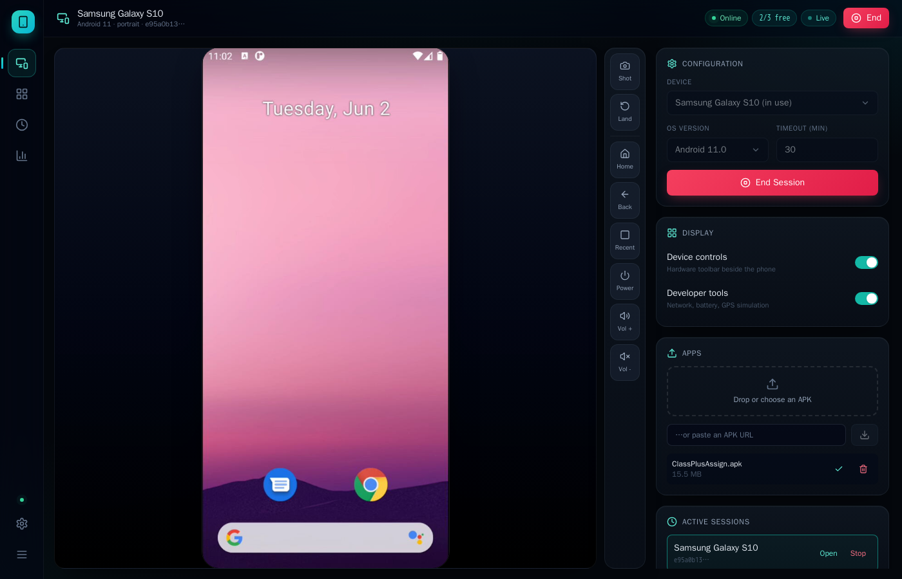
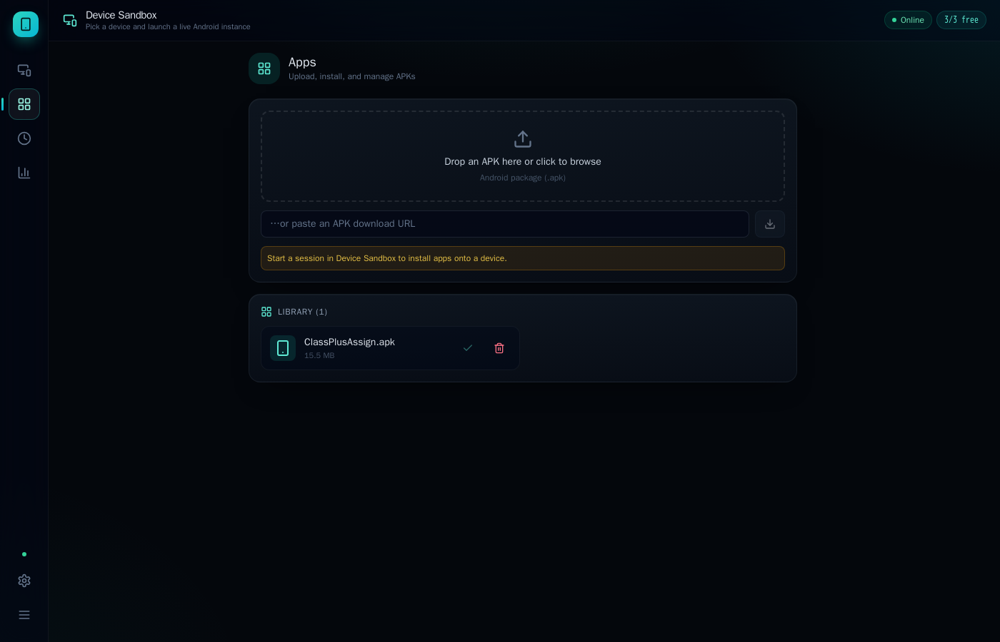
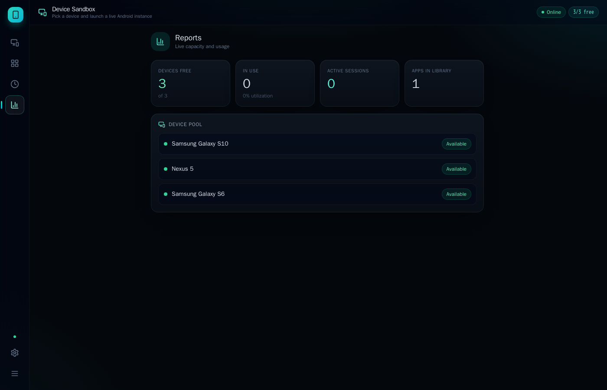
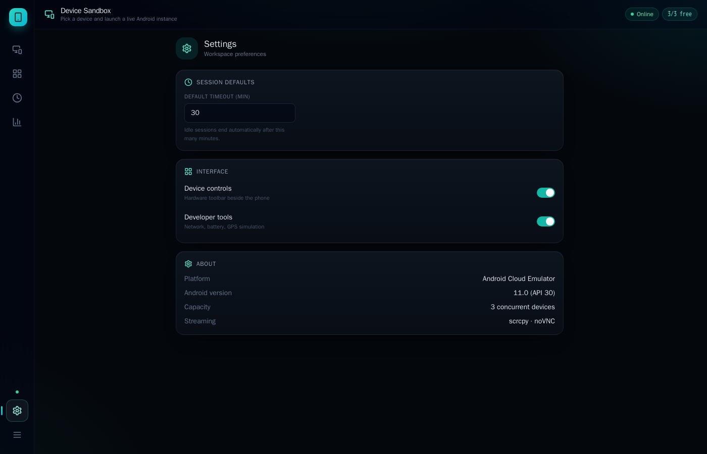
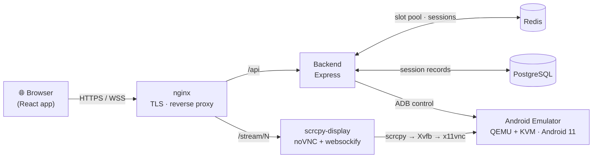

<div align="center">

# 📱 Android Emulator Platform

### Real Android devices, streamed live to your browser — no install, no signup.

A self-hosted, open-source alternative to **Appetize.io**. Launch a real Android emulator in one click, touch and type on it in real time, drag-and-drop an APK to install it, and simulate GPS, battery, and network — all from a single browser tab.

[](https://178-63-95-122.sslip.io)

[](LICENSE)




</div>

---

## ✨ Highlights

- 🚀 **One-click live device** — pick a phone, hit *Start*, and a pre-warmed emulator is streaming in seconds (no per-session boot wait).
- 👆 **Real-time touch & keyboard** — native, low-latency input over [scrcpy](https://github.com/Genymobile/scrcpy). Your laptop keyboard maps straight to the device.
- 📦 **Install any APK** — drag-and-drop a file or paste a download URL; install + auto-launch on the live device.
- 🎛️ **Hardware controls** — Home, Back, Recents, Power, Volume, rotate, and screenshot from a dock beside the phone.
- 🌐 **Developer tools** — throttle the network (Wi-Fi → 4G → 3G → EDGE → offline), set the battery level, spoof GPS (city presets), and open any URL on the device.
- 📊 **Live dashboard** — Apps library, session history, and a real-time capacity/utilization report.
- 🔒 **Production-ready edge** — nginx reverse proxy, automatic **Let's Encrypt HTTPS**, and all streams tunnelled through one secure origin (zero mixed-content).
- 🎨 **Polished SaaS UI** — React + Tailwind, glassmorphism, teal/cyan theme, meaningful motion, fully responsive.

---

## 🖼️ Screenshots

<table>
  <tr>
    <td width="50%"><br/><sub><b>Apps</b> — upload, install & manage APKs</sub></td>
    <td width="50%"><br/><sub><b>Reports</b> — live capacity & device pool</sub></td>
  </tr>
  <tr>
    <td colspan="2"><br/><sub><b>Settings</b> — session defaults, interface toggles & platform info</sub></td>
  </tr>
</table>

---

## 🏗️ How it works

The hard part of streaming a phone to a browser is doing it **securely and with real input**. Here's the full path of a tap:



1. The **backend** keeps a **pre-warmed pool** of emulator slots in Redis. Starting a session just hands one out — no boot wait.
2. Each emulator has a paired **`scrcpy-display`** container that renders *only* the phone screen (scrcpy → Xvfb → x11vnc → websockify → noVNC).
3. **nginx** serves the React app, proxies the API, and tunnels each stream at `/stream/<slot>/` over **TLS** — so the live video + WebSocket input share one secure origin (no `http://ip:port`, no mixed-content blocks).
4. Touches and keystrokes ride **scrcpy's native input** straight into Android's InputManager — real, low-latency, and keyboard-mapped.

> 💡 **Why scrcpy + noVNC instead of a custom WebRTC bridge?** It gives native keyboard/gesture mapping and rock-solid latency with far less moving machinery. Earlier MSE/ffmpeg and ws-scrcpy approaches were prototyped and dropped — see the inline notes in `scrcpy-display/` and `backend/src/routes/emulator.js`.

---

## 🧰 Tech stack

| Layer | Technologies |
|---|---|
| **Frontend** | React 18, Vite 5, Tailwind CSS 3, lucide-react |
| **Backend** | Node.js, Express 4, Redis (slot pool + cache), PostgreSQL 15, Multer, Winston, dockerode, `ws`, Helmet, rate-limiting |
| **Emulation** | [budtmo/docker-android](https://github.com/budtmo/docker-android) · Android 11 · QEMU + **KVM** · GPU passthrough (`-gpu host`, `/dev/dri`) |
| **Streaming** | scrcpy → Xvfb → x11vnc → websockify → noVNC |
| **Infra / Edge** | Docker Compose, nginx, Let's Encrypt (certbot, auto-renew) |
| **Observability** | Prometheus + Grafana |

**Default device pool:** Samsung Galaxy S10 · Nexus 5 · Samsung Galaxy S6 (Android 11) — 3 pre-warmed concurrent slots.

---

## 🚀 Quick start (self-host)

### Prerequisites
- A Linux host with **Docker** + **Docker Compose**
- **KVM** enabled (`/dev/kvm`) — required for usable emulator performance (a bare-metal or nested-virt VPS, e.g. Hetzner)
- ~8 GB RAM for the 3-device pool

### Run it

```bash
# 1. Clone
git clone https://github.com/adit9852/android-emulator-platform
cd android-emulator-platform

# 2. Configure environment (DB creds, JWT secret, etc.)
cp .env.example .env   # then edit values

# 3. Build & launch the whole stack
docker compose up -d --build

# 4. Open the app
#    http://<your-server-ip>
```

The emulator pool boots once at startup and stays warm. First boot pulls images and provisions Android — give it a few minutes.

### Make it a public HTTPS link
Point a domain (or use a free `sslip.io` host) at the server, then issue a cert with certbot's webroot challenge and enable the `443` server block in `nginx/nginx.conf`. The live demo runs exactly this setup with auto-renewal. See **[DEPLOYMENT_GUIDE.md](DEPLOYMENT_GUIDE.md)**.

---

## 🔌 API reference

All routes are under `/api`. Highlights:

| Method | Endpoint | Description |
|---|---|---|
| `GET` | `/emulator/devices` | List devices and availability |
| `GET` | `/emulator/pool` | Slot pool status |
| `POST` | `/emulator/session` | Start a session (claims a slot) |
| `GET` | `/emulator/session/:id` | Session details + stream URL |
| `DELETE` | `/emulator/session/:id` | End a session (releases the slot) |
| `GET` | `/emulator/sessions` | List active sessions |
| `POST` | `/emulator/key` | Press a hardware key (Home/Back/…) |
| `POST` | `/emulator/tap` · `/swipe` · `/text` | Inject touch / text |
| `POST` | `/emulator/rotate/:id` | Toggle portrait ↔ landscape |
| `GET` | `/emulator/screenshot/:id` | Capture the screen |
| `POST` | `/emulator/gps` · `/battery` · `/network` · `/url` | Simulate sensors / open a URL |
| `POST` | `/upload/apk` · `/upload/apk-url` | Upload an APK (file or URL) |
| `POST` | `/upload/install` | Install an APK on a live device |
| `GET` / `DELETE` | `/upload/apks` · `/upload/apk/:id` | List / delete library APKs |
| `GET` | `/health` | Health check |

---

## 📁 Project structure

```
android-emulator-platform/
├── frontend/         # React + Vite + Tailwind SPA (the dashboard & phone view)
├── backend/          # Express API — slot pool, sessions, input, APKs (Redis + Postgres)
├── emulator/         # Android emulator image (budtmo-based, Android 11)
├── scrcpy-display/   # Per-emulator screen-streaming container (scrcpy → noVNC)
├── nginx/            # Reverse proxy + TLS termination + /stream routing
├── monitoring/       # Prometheus + Grafana config
├── docs/             # Screenshots
└── docker-compose.yml
```

---

## 🗺️ Roadmap

- [ ] User accounts & API keys (auth scaffolding already present)
- [ ] Horizontal scaling of the emulator pool across hosts
- [ ] Session recording & shareable replays
- [ ] More devices / Android versions
- [ ] Per-session resource quotas & idle reaping UI

---

## ⚠️ Notes & limitations

- The default deployment runs **3 concurrent device slots** — capacity scales with host CPU/RAM.
- The Android **launcher is portrait-locked** (standard Android); rotation takes effect *inside* apps that support landscape.
- KVM is effectively mandatory — without hardware virtualization the emulators are too slow to be usable.

---

## 🙏 Acknowledgements

Built on the shoulders of [scrcpy](https://github.com/Genymobile/scrcpy), [noVNC](https://github.com/novnc/noVNC), [budtmo/docker-android](https://github.com/budtmo/docker-android), and the wider Android emulator community. Design benchmarked against (not copied from) Appetize.io.

## 📄 License

[MIT](LICENSE) — free to use, modify, and self-host.

<div align="center">
<sub>Made with ☕ and a lot of <code>docker compose up</code>.</sub>
</div>
